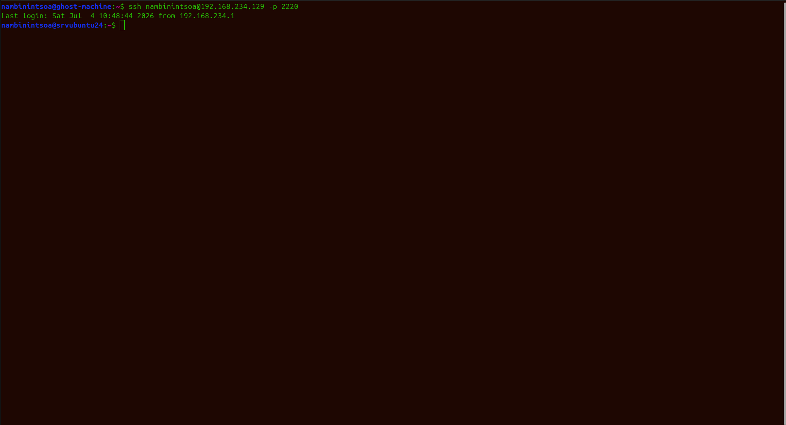

#  Déploiement Sécurisé d'une App React sur Nginx (SSH + HTTPS + Firewall)

##  Description
Projet d'apprentissage DevOps : déploiement d'un portfolio React sur un 
serveur Ubuntu, sécurisé avec authentification SSH par clé, HTTPS 
(certificat auto-signé) et pare-feu UFW.

##  Architecture

Client (navigateur) 
      ↓ HTTPS (443)
Nginx (reverse proxy statique)
      ↓
/var/www/html (build React/Vite)

##  Stack technique
- Ubuntu Server 22.04
- Nginx
- OpenSSL (certificat auto-signé)
- UFW (firewall)
- React + Vite (application déployée)

##  Fonctionnalités mises en place
- [x] Authentification SSH par clé publique uniquement (port custom 2220)
- [x] Serveur web Nginx servant une application React buildée
- [x] Chiffrement HTTPS avec redirection automatique HTTP → HTTPS
- [x] Pare-feu configuré (deny by default, allow explicite)

##  Captures d'écran
### Connexion SSH sécurisée

### Site en HTTPS

##  Comment reproduire ce projet
1. Cloner ce repo
2. aller vers docs/notes-techniques.md

##  Difficultés rencontrées & solutions
- Erreur de syntaxe Nginx (point-virgules manquants) → corrigé en 
  testant systématiquement avec `nginx -t` avant chaque redémarrage
- Risque de blocage SSH avec UFW → testé le port custom avant de 
  bloquer le port par défaut

##  Ce que j'ai appris
- Gestion d'un serveur Linux distant
- Bonnes pratiques de sécurisation SSH
- Fonctionnement du protocole TLS/HTTPS
- Configuration d'un pare-feu (principe du "deny by default")
- Automatisation avec bash

##  Améliorations futures
- [ ] Déployer avec un vrai nom de domaine + Let's Encrypt
- [ ] Ajouter un pipeline CI/CD (GitHub Actions)